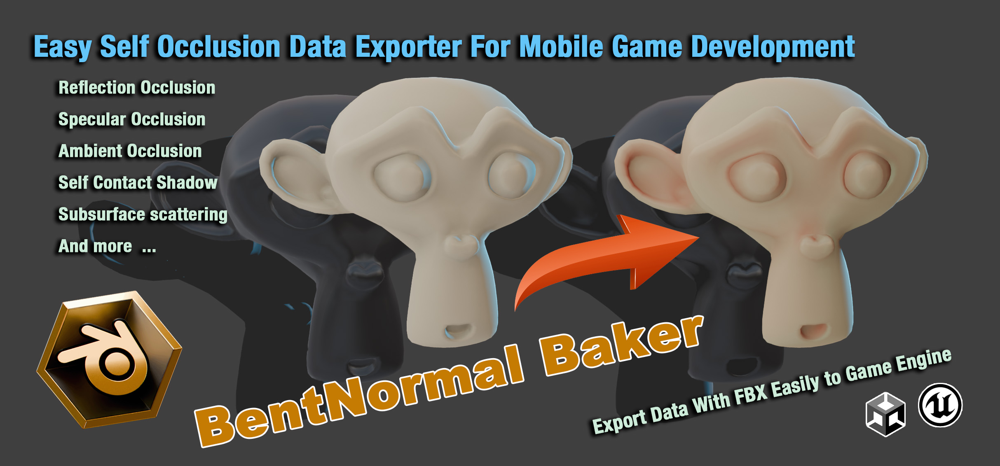
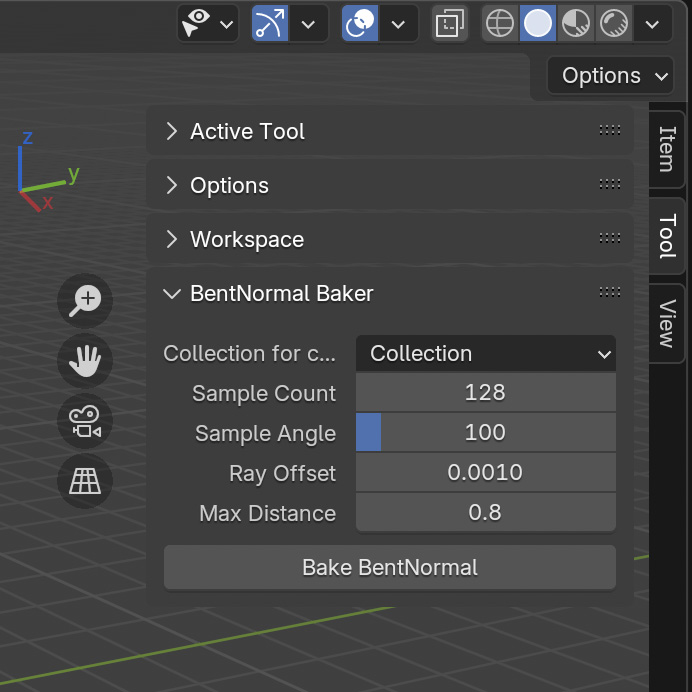
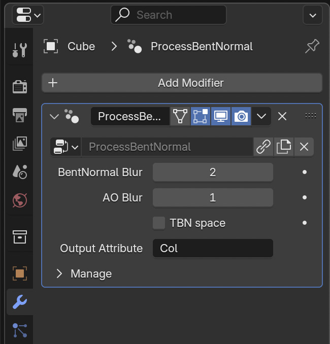
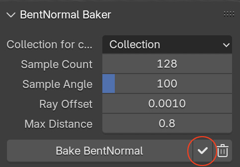

    English</a>&nbsp ｜ &nbsp<a href="README_zh.md">中文</a>&nbsp

# BentNormal Baker

A Blender add-on for baking bent normals and other 3D self-occlusion data.

## Features

- Bakes 4 coefficients of first-order spherical harmonics to vertex colors, preserving data when exporting to FBX
- Includes demo shaders showing how to apply spherical harmonics for bent normal and AO
- Provides debug materials based on bake results for visualizing cheap SSS, reflection occlusion, and contact shadows suitable for mobile game development
- Multi-threaded baking process for optimal CPU utilization
- Customizable parameters: sample count, ray offset, max distance
- Automatic tangent space calculation

## Installation

1. Copy the add-on folder to Blender's add-ons directory
2. Enable the add-on in Blender

## Usage

1. Find the `BentNormal Baker` panel in the sidebar of the 3D view

> 

2. Parameters:
   - Collection for collision: Name of collection containing collision objects
   - Sample Count: Number of samples per vertex
   - Sample Angle: Sampling angle
   - Ray Offset: Ray starting point offset
   - Max Distance: Maximum ray distance

3. Select the mesh object to bake and add all collision objects to the specified collection

4. Ensure all collision objects have transforms at world origin (location 0, rotation 0, scale 1). Use <kbd>Ctrl</kbd>(<kbd>Cmd</kbd>)+<kbd>A</kbd> → `Apply All Transforms`

5. Click <kbd>Bake</kbd> to start baking

6. After baking, the following mesh attributes will be generated:
   - `SH0`: 0th order spherical harmonic coefficient (FLOAT)
   - `SH1`: 1st order spherical harmonic coefficients (FLOAT_VECTOR)
   - `Tangent`: Tangent vectors (FLOAT_VECTOR)

7. A `ProcessBentNormal` geometry node modifier will be automatically added:
   - Adjust bent normal and AO blur in the modifier panel
   - Option to store results in TBN space

> 

8. A `Baker_DebugMaterial` will be automatically added:
   - Use <kbd>Shift</kbd>+<kbd>Ctrl</kbd>(<kbd>Cmd</kbd>)+<kbd>Click</kbd> on `Debug SSS Shading` node to toggle debug views
   - Use `Effect Toggle` in `Debug SSS Shading` node to preview effects
   - Press <kbd>Tab</kbd> in `Debug SSS Shading` node to view shader implementation details

9. For skinned meshes, enable `TBN space` in the geometry node modifier. Disable for static meshes.

10. Click the <kbd>✓</kbd> button to save the results to the vertex color attributes set in the `ProcessBentNormal` geometry node modifier and clean up intermediate data

> 

## Notes

- Developed for Blender 4.3, compatibility issues may occur in versions below 4.2
- Ensure all collision objects have proper transforms before baking
- All collision objects must be in the specified collection
- Higher `Sample Count` improve accuracy but increase computation time
- `Ray Offset` too small may cause self-intersection, too large may cause light leaks
- Adjust `Max Distance` according to scene scale
- If there is noticeable color difference at UV seams when previewing in `TBN space`, you can create a new material and add a `Tangent` node that use `UV Map` as parameter. While previewing the effect of this node, adjust the model's UV until there is no noticeable color difference at the seams, or try changing the position of the UV seams. 

## Development

- Written in Python 3.10+
- Uses NumPy for efficient numerical computation
- Utilizes Blender's BVH tree for ray casting
- Supports multi-threaded parallel computation
